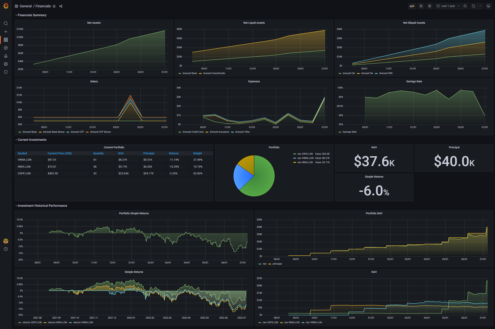

# Financials

Financials is a way to track your financial independence track in Singapore's context. This is still very much a work in progress, as of now, only the investments portions work. We use Grafana as the frontend and it is assumed that Grafana is installed at the moment.



## Feature roadmap

This list is not exhaustive but a wishlist that I would work on when I'm free. Mostly credit to this [link](https://www.reddit.com/r/singaporefi/comments/p9p668/the_vital_ratios_to_track_on_your_journey_to/).

- [x] Stock Portfolio
- [x] Monthly expenditure
- [x] Income
- [x] Total Net assets
- [ ] Liabilities
- [ ] Financial Independence Quotient


## Installing

Helm is the preferred way to install this. First, get an API key here: https://www.alphavantage.co/support/#api-key

Then deploy using this command, see `charts/financials/values.yaml` for the defaults.

```bash
helm repo add ashwinath https://ashwinath.github.io/helm-charts/
helm repo update
helm upgrade financials ashwinath/financials \
    --install \
    --wait \
    --namespace=financials \
    --values=values.yaml
```

A sample `values.yaml` may look something like this, with all the trade information inside.

```yaml
financials:
  alphavantageAPIKey: yourAlphaVantageAPIKeyHere

  financialsGrafana:
    apiKey: yourAPIKeyHere
    # or your grafana endpoint here.
    endpoint: grafana.infra

  trades: |-
    date_purchased,symbol,trade_type,price_each,quantity
    2021-03-11,IWDA.LON,buy,76.34,250
    2021-03-29,CSPX.LON,buy,400.66,50
    2021-03-31,IWDA.LON,buy,76.78,250
    2021-03-31,CSPX.LON,buy,401.05,100
    2021-04-06,IWDA.LON,buy,78.45,250
    2021-04-06,CSPX.LON,buy,411.54,100
    2021-04-23,IWDA.LON,buy,80.2,250
    2021-04-23,CSPX.LON,buy,419.68,80
    2021-05-12,CSPX.LON,buy,420.15,100
    2021-05-12,IWDA.LON,buy,80.17,250
    2021-05-13,CSPX.LON,buy,410.68,100
    2021-05-13,IWDA.LON,buy,78.3,250
    2021-05-26,CSPX.LON,buy,425.95,100
    2021-06-28,IWDA.LON,buy,83.02,250
    2021-08-19,CSPX.LON,buy,446.12,100
    2021-09-24,IWDA.LON,buy,85.29,250
    2021-10-27,IWDA.LON,buy,87.28,250

  assets: |-
    date,type,amount
    2020-03-31,CPF,1000
    2020-03-31,Bank,20000
    2020-03-31,Mortgage,-40000
    2020-03-31,Investments,20000

  expenses: |-
    date,type,amount
    2020-03-31,Credit Card,500
    2020-03-31,Reimbursement,-200
    2020-03-31,Tithe,800

  income: |-
    date,type,amount
    2021-03-11,Base,500
    2021-03-11,Bonus,200

postgresql:
  postgresqlPassword: somePasswordHere
  persistence:
    storageClass: openebs-hostpath
    size: 10Gi
```
