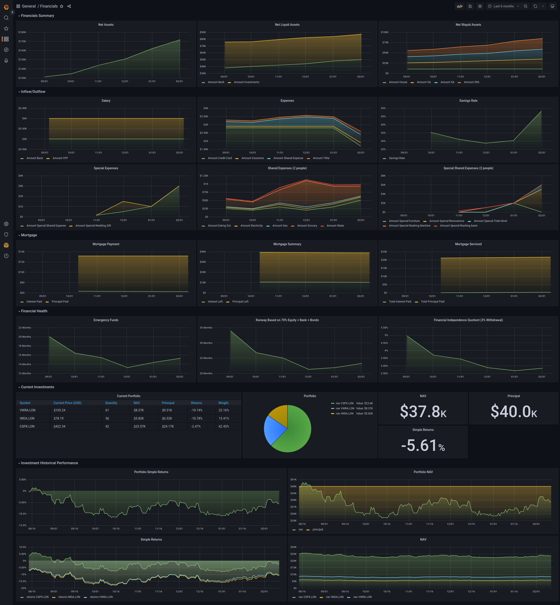

# Financials

Financials is a way to track your financial independence track in Singapore's context. This is still very much a work in progress, see the 'Feature Roadmap' for more details. We use Grafana as the frontend and it is assumed that Grafana is installed at the moment.



## Feature roadmap

This list is not exhaustive but a wishlist that I would work on when I'm free. Mostly credit to this [link](https://www.reddit.com/r/singaporefi/comments/p9p668/the_vital_ratios_to_track_on_your_journey_to/).

- [x] Stock Portfolio
- [x] Monthly expenditure
- [x] Income
- [x] Total Net assets
- [x] Automatic detection of investment amount
- [x] Financial Independence Quotient
- [x] Mortgage


## Installing

Helm is the preferred way to install this. First, get an API key here: https://www.alphavantage.co/support/#api-key

Then deploy using this command, see `charts/financials/values.yaml` for the defaults.

```bash
helm repo add ashwinath https://ashwinath.github.io/helm-charts/
helm repo update
helm upgrade financials ashwinath/financials \
    --install \
    --wait \
    --namespace=financials \
    --values=values.yaml
```

A sample `values.yaml` may look something like this, with all the trade information inside.

```yaml
financials:
  alphavantageAPIKey: yourAlphaVantageAPIKeyHere

  financialsGrafana:
    apiKey: yourAPIKeyHere
    # or your grafana endpoint here.
    endpoint: grafana.infra

  trades: |-
    date_purchased,symbol,trade_type,price_each,quantity
    2021-03-11,IWDA.LON,buy,76.34,250

  assets: |-
    date,type,amount
    2020-03-31,CPF,1000
    2020-03-31,Bank,20000
    2020-03-31,Investments,20000

  expenses: |-
    date,type,amount
    2020-03-31,Credit Card,500
    2020-03-31,Reimbursement,-200
    2020-03-31,Tithe,800

  income: |-
    date,type,amount
    2021-03-11,Base,500
    2021-03-11,CPF,500
    2021-03-11,Bonus,200
    2021-03-11,CPF Bonus,200

  mortgage: |-
    mortgages:
    - total: 50000.0
      mortgage_first_payment: 2022-10-10
      mortgage_duration_in_years: 25
      mortgage_end_date: 2047-10-10
      interest_rate_percentage: 2.6
      downpayments:
      - date: 2021-10-10
        sum: 1000.0
      - date: 2021-12-12
        sum: 20000.0

  shared_expenses: |-
    date,type,amount
    2023-01-01,Special:Renovations,5000.00
    2023-01-01,Electricity,100.00
    2023-01-01,Water,50.00
    2023-01-01,Gas,30.00
    2023-01-01,Grocery,300.00
    2023-01-01,Eating Out,500.00

postgresql:
  postgresqlPassword: somePasswordHere
  persistence:
    storageClass: openebs-hostpath
    size: 10Gi
```

## Classification of data

### Assets

There are three main graphs here; "Net Assets", "Net Liquid Assets" and "Net Illiquid Assets". There is integration with investment data here. The asset liquidity are as follows.

CSV file: `income.csv`

| Asset Class           | Liquidity | Autofilled | Remarks                                                |
| --------------------- | --------- | ---------- | ------------------------------------------------------ |
| Bank                  | Liquid    | false      | No easy API to retrieve information                    |
| Investments           | Liquid    | true       | Determined from trade date                             |
| SRS                   | Illiquid  | false      | No easy API to SRS investments                         |
| Ordinary Account (OA) | Illiquid  | false      | Might have to check if there are APIs for CPF/Singpass |
| Special Account (SA)  | Illiquid  | false      | Might have to check if there are APIs for CPF/Singpass |
| Medisave              | Illiquid  | false      | Might have to check if there are APIs for CPF/Singpass |
| House                 | Illiquid  | true       | Determined from mortgage schedule                      |

### Expenses

These values will be used in the calculation of average expense which is used in "Emergency Funds", "Runway Based on 70% Equity + Bank" and "Financial Independence Quotient (3% Withdrawal)".

CSV file: `expenses.csv`

| Expense Type    | Displayed | Used in calculation | Remarks                                                                                           |
| ----------------| --------- | ------------------- | ------------------------------------------------------------------------------------------------- |
| Credit Card     | true      | true                | Note that this value is post reimbursement                                                        |
| Reimbursement   | false     | true                | This value is merged with credit card                                                             |
| Special:.\*     | true      | false               | These are special one off purchases for special events that will not be used for average spending |
| (Anything else) | true      | true                | Will be displayed as an individual line                                                           |

### Income

These values will be used in the calculation of "Savings Rate".

CSV file: `income.csv`

| Salary Type          | Included in calculation | Remarks                                                  |
| -------------------- | ----------------------- | -------------------------------------------------------- |
| Base                 | true                    | This is your base pay                                    |
| Base Bonus           | true                    | This is your base pay's bonus                            |
| CPF                  | false                   | This is your CPF contribution, considered to be illiquid |
| CPF.\*               | false                   | This is your CPF contribution, considered to be illiquid |

### Trades

These values will be used in the calculation of investments as well as it's breakdown. For now I am only going to support London Stock Exchange. US stock exchanges should also work but I have not tried it.

### Mortgage

These values will be used in the calculation of mortgage repayments.

### Split Expenses

These values will be used to calculate the finances incurred by multiple people. Currently it will only be split among 2 people and added to personal expenses. However, special expenses will be excluded.

CSV file: `shared_expenses.csv`

| Expense Type    | Displayed | Used in calculation | Remarks                                                                                           |
| ----------------| --------- | ------------------- | ------------------------------------------------------------------------------------------------- |
| Special:.\*     | true      | false               | These are special one off purchases for special events that will not be used for average spending |
| (Anything else) | true      | true                | Will be displayed as an individual line                                                           |
